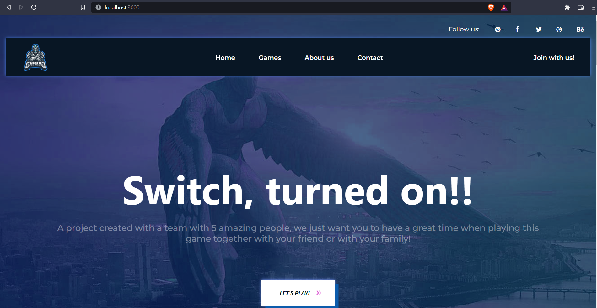

# 🎮 AG Gaming 🎮

## 1. About this project 🚀🚀🚀

AG Gaming is a project founded by a team of 5 members who are students of the University of Technology - VNU. Conceived since 2020, AG Gaming has now been officially built and achieved certain successes.

### What's inside AG team?

- Trịnh Ngọc Huỳnh (Model)
- Vũ Thanh Lâm (Game Graphic)
- Lê Văn Huy (Game Graphic)
- Đỗ Tấn Lập (ReactJS Frontend)
- Phạm Quang Phong (NodeJS backend)

## 2. Before you continue❗

This project use ReactJS for the front-end, NodeJS and MongoDB for the back-end, TensorFlowJS for the model.
Make sure you have installed the lastest version of ReactJS and NodeJS.

### How to install and play⁉️

#### 1.Clone the repository

    git clone https://github.com/lvhuy2002/game-AI-web

#### 2. Install the dependencies

    cd game-AI-web
    npm install

#### 3. Run the project

    npm start

### 4. This project will be running at localhost:3000 on your browser

#### Enjoy this game! Thanks for your patience❤️

## This project is inspired by the game Magic Touch and Face Dance Challenge.
## Related Link
     Model: https://github.com/huynhspm/ProjectDL
     React: https://reactjs.org/
     NodeJS: https://nodejs.org/en/about/
     TensorFlow: https://www.tensorflow.org/resources/learn-ml
#### If you have any feedback, please contact 20020202@vnu.edu.vn.

Copyright © AG-Gaming - 2022. All Rights Reserved
